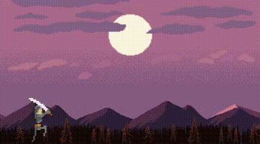

# Clases para animar fondo y personajes

**Atencion** esto es solo una prueba, probablemente necesite mejorar 

## Animar fondo

Dentro del archivo *"background.wlk"* se encuentra la clase *"Background"*. 
Esta clase desplasa la imagen pasada de derecha a izquierda con la velocidad indicada, este debe ser un numero entero (se recomienda ir probando las diferentes velocidades)

Esta clase recive dos parametros

- **image**: Un string - La imagen de fondo
- **Velocidad**: Un numero - La velcidad con la que se movera el fondo

>const fondo = new Background( image = "fondo.png", velocidad = 3 )

Se pueden combinar diferentes imagenes que pasen a diferentes velocidades para lograr un efecto con el siguiente:

___

## Animar personaje

Dentro de *"character.wlk"* se encuentra la clase *"CharacterAnimado"*.
Esta clase toma tres argumentos

- **images**: Un array (lista) - Este debe contener imagenes (sprites) del personaje que se desea animar en el orden en el que pasara la animacion

    `const sprites = ["sprite1.png","sprite2.png","sprite3.png","sprite4.png","sprite5.png"]`
- **Personaje**: Un objeto posicionable - Este debe ser un objeto con los atributos *"image"* y *"position"* tal como lo pide Wollok game 

    ` object personaje {
   var property image
   var property position
 }`

 - *opcional* **velocidad**: Un numero - Inicializada en 50. Este refiere a la velocidad en la que pasaran las imagenes.

> var personajeAnimado = new CharacterAnimado(
			images = sprites, 
			personaje = soldado,
			velocidad = 250
		)

___

Tambien se encuentra la clase abstracta *"Personaje"*, la cual modela un personaje para facilitar la creacion de nuevas instancias de personajes animados.

Esta clase contiene varios metodos para variar entre diferentes iteraciones de sprites, pasar de una animacion a otra, etc. El funcionamiento de los mismos esta explicado en cada metodo.

Para crear un personaje a partir de esta clase se debe crear un objeto que herede de esta clase "Personaje", y sobreescribirle el metodo "spritesIniciales()"

>object soldado inherits Personaje{
	const spriteAtacar = ["atacar1.png","atacar2.png","atacar3.png"]
	override method spritesIniciales() = spriteAtacar
}

___
Se aconseja revisar el codigo ya que hay implementadas varias funciones que las cuales seria muy largo de explicar acá

Basicamente esto es todo lo que logre hacer:
- Cambiar entre personajes
- Agregar una animacion independiente para cada uno
- Detener el fondo si se desea (Por Ej. si un personaje muere)

___

### Problemas encontrados que no pude solucionar
- El metodo *"onTick"* parece no funcionar del todo bien, ya que las animaciones se realentizan cada cierto tiempo.
- Por algun motivo, quiza tenga que ver con el funcionamiento de *"onTick"*, en el metodo *"cambiarSpriteDe_A_()"* en la clase *"Personaje"*, si se le pasa como primer argumento una lista con muchos elementos (o sea un sprite con muchos frames), esta no se reproduce en su totalidad. Se intento solucionarlo alargando el tiempo en que se reproduce una y pasa a la otra, pero esto hace que surjan otros errores, como que se reproduce mas de una vez la animacion si esta tiene pocos frames.

